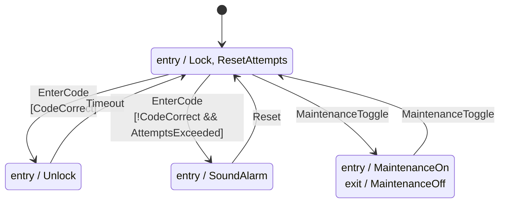

# Door lock FSM

```mermaid
stateDiagram-v2
    [*] --> Locked
    Locked : entry / Lock, ResetAttempts
    Unlocked : entry / Unlock
    Alarm : entry / SoundAlarm
    Maintenance : entry / MaintenanceOn<br/>exit / MaintenanceOff
    Locked --> Unlocked: EnterCode<br/>[CodeCorrect]
    Locked --> Alarm: EnterCode<br/>[!CodeCorrect && AttemptsExceeded]
    Unlocked --> Locked: Timeout
    Alarm --> Locked: Reset
    Locked --> Maintenance: MaintenanceToggle
    Maintenance --> Locked: MaintenanceToggle
```
